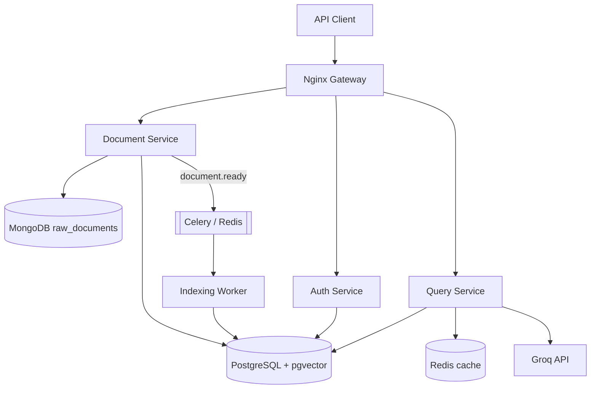
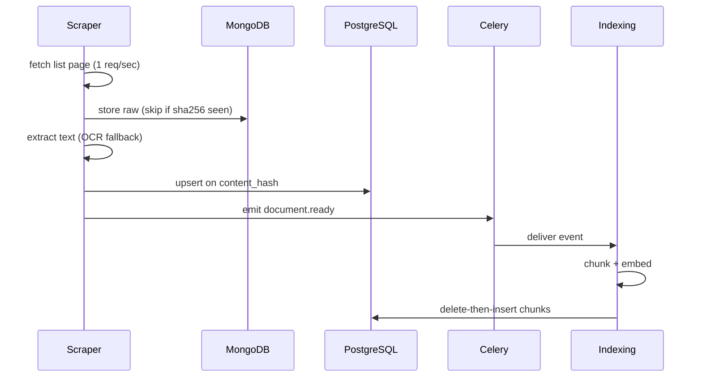
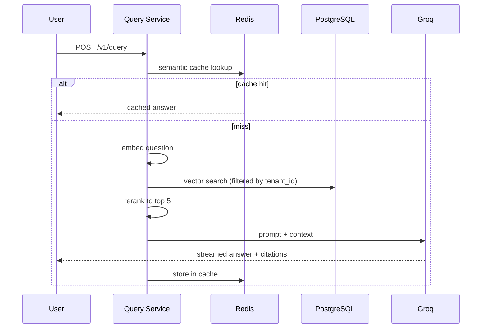

# Architecture

## 1. Context (C4 L1)

<!-- ```mermaid
graph LR
    CO[Compliance Officer] --> SYS
    AN[Analyst] --> SYS
    AU[Auditor] --> SYS
    SYS[Regulatory RAG Platform]
    SYS --> RBI[RBI Website]
    SYS --> GROQ[Groq LLM API]
``` -->

'''mermaid
graph LR
    CO[Compliance Officer] --> SYS
    AN[Analyst] --> SYS
    AU[Auditor] --> SYS
    SYS[Regulatory RAG Platform]
    SYS --> RBI[RBI website]
    SYS --> GROQ[Groq LLM API]
'''

## 2. Containers (C4 L2)



## 3. Service ownership — one writer per table

| Service | Owns (writes) | Reads |
|---|---|---|
| Auth | users, tenants, roles, refresh_tokens | — |
| Document | Mongo raw_documents, PG documents | — |
| Indexing | chunks (incl. embeddings) | documents |
| Query | conversations, messages, semantic cache | documents, chunks |

## 4. Data boundary

**Mongo = what we received. Postgres = what we know.**

| Mongo `raw_documents` | Postgres |
|---|---|
| Raw HTML / PDF bytes, as received | Typed, validated, constrained |
| Schema drifts freely | Strict schema |
| Immutable audit trail | Transactional, versioned |

A parser bug means a re-parse from Mongo, not a re-scrape of RBI.

## 5. Ingestion flow



## 6. Query flow



## 7. Non-functional targets

| Attribute | Target |
|---|---|
| p95 latency | < 3 s; first token < 1 s |
| Scale | 500 tenants, 10K DAU, ~8 QPS peak |
| Storage | 4M chunks ≈ 19 GB → pgvector sufficient |
| Availability | 99.9% reads |
| Constraint | Cost-bound, not throughput-bound |