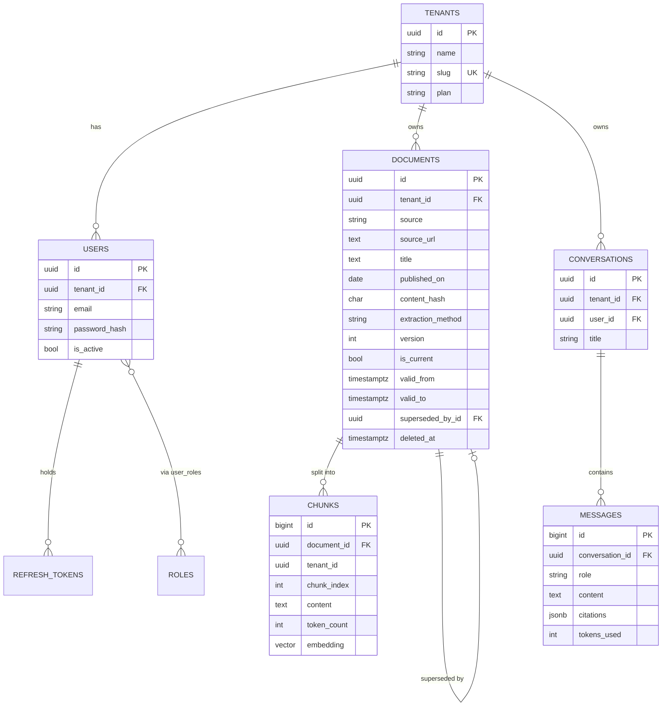

# Data Model

## ERD



Cardinality notation: `||` exactly one · `o{` zero or many · `o|` zero or one.

## Index strategy

| Table | Index | Why |
|---|---|---|
| documents | UNIQUE (tenant_id, source_url, version) | One row per version of a source document |
| documents | UNIQUE (tenant_id, content_hash) | Idempotent ingestion, enforced by the schema |
| documents | (tenant_id, published_on) | The common list query, tenant-first |
| documents | (tenant_id) WHERE is_current | Partial index: most queries want current rows only |
| chunks | UNIQUE (document_id, chunk_index) | Chunk order is unique within a document |
| chunks | (tenant_id, document_id) | Retrieval filters before the vector scan |
| chunks | HNSW (embedding) | Approximate nearest neighbour search (added in S21) |
| users | UNIQUE (tenant_id, email) | The same person may exist in two tenants |

Every index on a tenant-owned table leads with `tenant_id`, so the isolation
filter is always usable by the index rather than applied after a scan.

## Multi-tenancy

Shared tables with `NOT NULL tenant_id` (see ADR 0005). Filtering is applied in
the repository layer, never by callers.

## Versioning

Documents are append-only. A new version sets the previous row's
`is_current = false` and `valid_to = now()`, then inserts a new row with
`version + 1` and a back-link via `superseded_by_id`.

- Current state: `WHERE is_current`
- As of a date: `WHERE valid_from <= :d AND (valid_to IS NULL OR valid_to > :d)`

Deletes are soft (`deleted_at`), because a regulated domain needs deletions to be
auditable and reversible.

## Mongo: raw_documents

Schema-free by design. Unique index on `(tenant_id, sha256)`, which is the first
idempotency gate in the pipeline.

```
_id, tenant_id, source, source_url, sha256,
fetched_at, http_status, content_type, raw_bytes | raw_html,
meta: { whatever the source page provided }
```